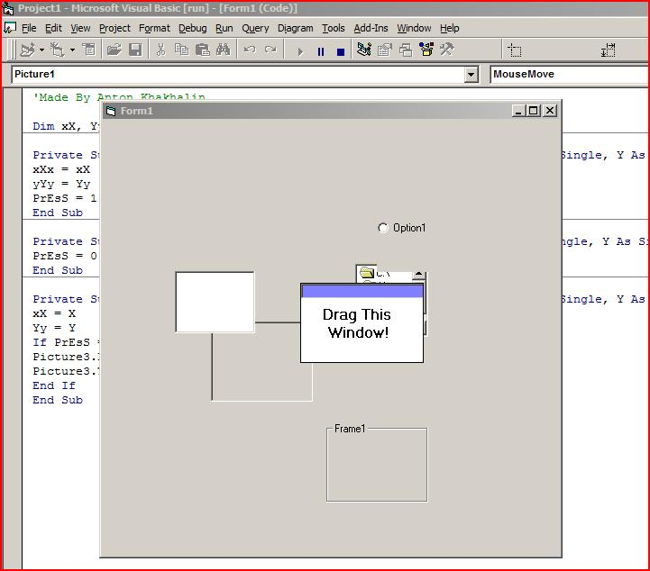



## drag / move a control over everything on the form \(small code\)

### Description

Enables you to drag / move a control or a window over everything on the form.
 
### More Info
 

             |
---                |---
**Submitted On**   |2008-12-14 13:10:16
**By**             |[Anton Anton](https://github.com/Planet-Source-Code/PSCIndex/blob/master/ByAuthor/anton-anton.md)
**Level**          |Intermediate
**User Rating**    |4.0 (8 globes from 2 users)
**Compatibility**  |VB 5\.0, VB 6\.0, VB Script
**Category**       |[VB function enhancement](https://github.com/Planet-Source-Code/PSCIndex/blob/master/ByCategory/vb-function-enhancement__1-25.md)
**World**          |[Visual Basic](https://github.com/Planet-Source-Code/PSCIndex/blob/master/ByWorld/visual-basic.md)
**Archive File**   |[drag\_\_\_mov21371112142008\.zip](https://github.com/Planet-Source-Code/anton-anton-drag-move-a-control-over-everything-on-the-form-small-code__1-71528/archive/master.zip)

